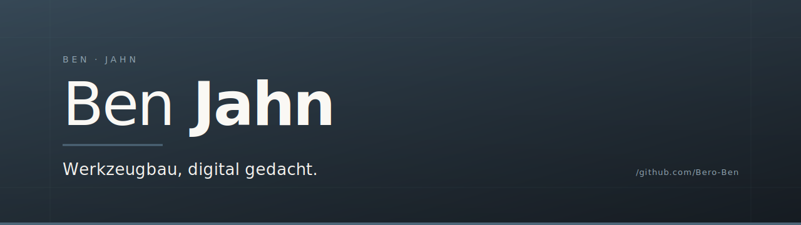

 

<table align="center" border="0">
<tr>
<td align="center">

**`Ben Jahn`** &nbsp;·&nbsp; IT‑Entwicklung &nbsp;·&nbsp; Digitalisierung &nbsp;·&nbsp; Automatisierung

</td>
</tr>
</table>

 

## Über mich

Leiter eines mittelständischen Werkzeugbau­betriebs und seit vielen Jahren leidenschaftlicher Hobby‑Entwickler. Im Hauptberuf am Werkstück, in der Freizeit am Code — und immer öfter dazwischen.

Mich interessieren vor allem **KI im Arbeitsalltag**, **Ninox‑Datenbanken** und alles rund um **eigene Server** — vom Aufsetzen bis zum täglichen Betrieb. Aus diesen Themen entstehen Tools, n8n‑Workflows und kleine Apps, die ich für den eigenen Betrieb baue. Mein Anliegen: **Automatisierung und Digitalisierung im Werkzeugbau** — dort, wo gewachsene Prozesse und moderne Software bisher selten zusammenfinden.

 

## Schwerpunkte

| | |
|---|---|
| **KI & Automatisierung** | LLM‑Integration, Claude / Anthropic‑Workflows, KI‑gestützte Tools für den Arbeitsalltag |
| **Server‑Administration** | Linux‑Server (Ubuntu), Hetzner‑Infrastruktur, Docker, Reverse‑Proxy, Backups, Monitoring |
| **Datenbank‑Entwicklung** | Ninox‑ERP‑Systeme, Postgres, Migration von Low‑Code zu Standalone‑Anwendungen |
| **Workflow‑Automatisierung** | n8n, Make.com, API‑Integrationen, Skript‑Pipelines |
| **Digitalisierung im KMU** | Prozess­analyse, Schulungs­konzepte, schrittweise Ablösung gewachsener Insellösungen |

 

## Aktuelle Projekte

<table>
<tr>
<td width="50%" valign="top">

#### &nbsp;·&nbsp; Zeitabrechnung
Browser‑Anwendung zur Personal­zeit­erfassung und ‑abrechnung. Im produktiven Einsatz.
*Intern, nicht öffentlich.*

</td>
<td width="50%" valign="top">

#### &nbsp;·&nbsp; JSON‑Vergleich
Schlankes Tool zum visuellen Diff zweier JSON‑Strukturen. Browser‑basiert, ohne Backend.
*Intern, nicht öffentlich.*

</td>
</tr>
<tr>
<td width="50%" valign="top">

#### &nbsp;·&nbsp; ERP‑System
Eigenständiges ERP für den Werkzeugbau — Ablösung gewachsener Low‑Code‑Strukturen. *Intern, nicht öffentlich.*

</td>
<td width="50%" valign="top">

#### &nbsp;·&nbsp; Standortkarte
Dynamische Karte aus Adress­datensätzen — visualisiert Kunden, Lieferanten und Standorte. *Intern, nicht öffentlich.*

</td>
</tr>
</table>

 

## Profil

 

 

---

**Ben** **Jahn** &nbsp;·&nbsp; Werkzeugbau, digital gedacht.

